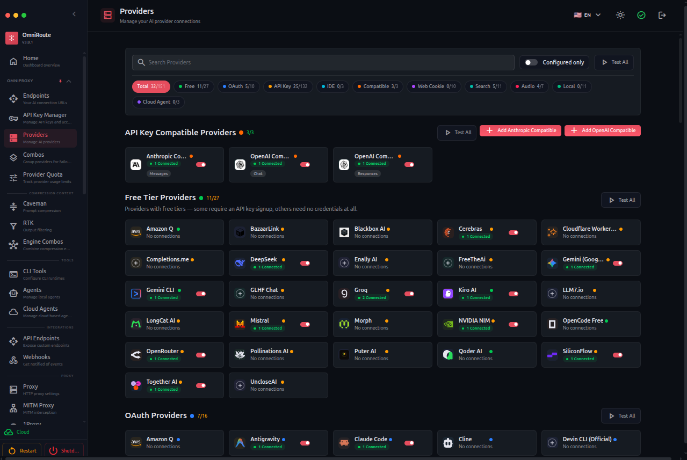

<div align="center">

# 🚀 OmniRoute — Coding-Focused Fork

### Pure focus on coding. No media bloat. No Redis. All the improvements that matter.

_A hardened, coding-only fork of OmniRoute — **one endpoint**, **150+ chat/embedding providers**, **13 routing strategies**, zero downtime. Multi-platform: **Web**, **Desktop (Electron)**, **Mobile (PWA + Termux)**. Fully extensible via **MCP Server (37 tools)**, **A2A Protocol**, and **Memory/Skills** systems. Available in **40+ languages**._

**Chat Completions • Responses API • Embeddings • Reranking • Moderations • Web Search • MCP Server • A2A Protocol • 100% TypeScript**

<br/>

> 🍴 **This is a personal fork of [diegosouzapw/OmniRoute](https://github.com/diegosouzapw/OmniRoute) that strips out everything not needed for coding.**
> Image/video/music/audio generation, vision bridge, Redis dependencies — all gone. Plus dozens of correctness, security, and stability fixes. See [Fork Notes](#-fork-notes--whats-different-here) below.

<br/>

[🚀 Quick Start](#-quick-start) • [💡 Features](#-key-features) • [🗜️ Compression](#%EF%B8%8F-prompt-compression--save-15-95-eligible-tokens-automatically) • [🍴 Fork Notes](#-fork-notes--whats-different-here) • [🌐 Providers](#-supported-providers--150-coding-only) • [🎯 Use Cases](#-use-cases--ready-made-combo-playbooks) • [❓ FAQ](#-frequently-asked-questions) • [📖 Docs](#-documentation)

</div>

<div align="center">

[](https://github.com/diegosouzapw/OmniRoute)
[](https://github.com/diegosouzapw/OmniRoute/blob/main/LICENSE)
[](https://nodejs.org/)
[](https://www.typescriptlang.org/)

</div>

---

## 🖼️ Main Dashboard

<div align="center">
  
</div>

---

## 📸 Dashboard Preview

<details>
<summary><b>Click to see dashboard screenshots</b></summary>

| Page           | Screenshot                                        |
| -------------- | ------------------------------------------------- |
| **Providers**  |    |
| **Combos**     |          |
| **Analytics**  |    |
| **Health**     |          |
| **Translator** |  |
| **Settings**   |      |
| **CLI Tools**  |    |
| **Usage Logs** |            |
| **Endpoints**  |     |

</details>

---

## 🍴 Fork Notes — What's Different Here

This fork prioritizes a single goal: **make OmniRoute as reliable, lean, and coding-focused as possible**. Everything that doesn't directly support chat-style coding workflows has been removed, and dozens of latent bugs and security issues have been fixed.

### 🧹 Removed (purged from code, tests, config, dependencies)

| Category                         | What's gone                                                                                                                                             | Why                                                    |
| -------------------------------- | ------------------------------------------------------------------------------------------------------------------------------------------------------- | ------------------------------------------------------ |
| **Image generation**             | `/v1/images/*`, all image handlers, translators, registries, providers (NanoBanana, SD WebUI, ComfyUI, RunwayML)                                        | Not needed for coding                                  |
| **Video generation**             | `/v1/videos/*`, all video handlers, providers (RunwayML, KIE-AI video)                                                                                  | Not needed for coding                                  |
| **Music generation**             | `/v1/music/*`, all music handlers, providers (KIE-AI music)                                                                                             | Not needed for coding                                  |
| **Audio transcription / speech** | `/v1/audio/*`, all audio handlers, providers (Deepgram, AssemblyAI, ElevenLabs, Cartesia, PlayHT, Inworld, AWS Polly)                                   | Not needed for coding                                  |
| **ChatGPT Web image route**      | `/v1/chatgpt-web/*` image generation endpoints, `chatgptImageCache` service                                                                             | Not needed for coding                                  |
| **Vision Bridge guardrail**      | `visionBridge.ts`, `visionBridgeHelpers.ts`, defaults, settings tab, 5 Zod schema fields, 7 test files                                                  | OmniRoute is text-only now                             |
| **Redis dependency**             | `ioredis` package entirely removed; rate limiter rewritten as pure in-memory sliding-window; API-key validation cache moved fully to in-memory + SQLite | One less service to run, no more `[REDIS] Error:` spam |
| **Dashboard media pages**        | `/dashboard/cache/media/`, media tabs in providers/playground                                                                                           | UI clean-up                                            |
| **Stale code**                   | `LEGACY_VERSION_SLOT_MIGRATIONS` (dead constant), dead `case "026"` migration branch                                                                    | Code health                                            |

**Net result:** ~15 routes removed, ~30 handler/service/translator/registry files deleted, ~50 tests pruned, ~10 dependencies trimmed. Zero references to image/video/music/audio remain in production code.

### 🛡️ Security Fixes (3.8.0 regressions)

| ID      | Issue                                                                                                                        | Fix                                                                                                                                             |
| ------- | ---------------------------------------------------------------------------------------------------------------------------- | ----------------------------------------------------------------------------------------------------------------------------------------------- |
| **R-1** | Redis cache let revoked/deleted/expired API keys keep authenticating for up to **1 hour** across multi-instance deployments  | Removed Redis entirely; in-memory cache now invalidates immediately on every mutation path (delete/revoke/expire/regenerate/update-permissions) |
| **R-2** | ioredis singleton became permanently dead after 10 reconnects, causing all rate-limiting to fail-open                        | N/A — Redis removed; new in-memory limiter has no transient-failure mode                                                                        |
| **S-1** | Skill sandbox had no stdout/stderr cap; a custom skill emitting MBs of output could OOM the parent process                   | Hard byte cap on captured child output                                                                                                          |
| **S-2** | Skill sandbox only sent `SIGTERM`; a skill that traps it survived the timeout                                                | `SIGTERM → grace period → SIGKILL` escalation                                                                                                   |
| **E-1** | Encryption auto-migration on every legacy ciphertext decrypt had no circuit breaker, was tied to the 3.7.8 CPU-loop incident | Circuit breaker + counter                                                                                                                       |

### 🐛 Correctness Fixes

| Area                                 | What was broken                                                                                                                                                                                                                         | What's fixed                                                                                                                                                                                                                               |
| ------------------------------------ | --------------------------------------------------------------------------------------------------------------------------------------------------------------------------------------------------------------------------------------- | ------------------------------------------------------------------------------------------------------------------------------------------------------------------------------------------------------------------------------------------ |
| **AutoCombo scoring**                | All four mode packs (fast/cheap/quality/balanced) missing `tierAffinity` + `specificityMatch` → NaN scores → silent comparator fallback                                                                                                 | All weights added; mode switching now actually re-orders routing                                                                                                                                                                           |
| **Responses API**                    | `responsesHandler` passed an incomplete object to `handleChatCore`, dropping `onStreamFailure`, `apiKeyInfo`, `cachedSettings`, and 5 other params → stream-failure callbacks lost, per-key cost tracking lost, semantic cache disabled | Full param forwarding                                                                                                                                                                                                                      |
| **Cursor agent Connect-RPC**         | `iterateConnectFrames` did unguarded `zlib.gunzipSync()` — one corrupted frame killed the generator irrecoverably                                                                                                                       | Per-frame try/catch + safe sentinel emission                                                                                                                                                                                               |
| **Cursor agent model sync**          | New cursor-agent CLI (2026.05+) wraps every model line in ANSI SGR escape codes, breaking the old parser. Also moved from `--model --help` trick to `--list-models`                                                                     | ANSI strip + new flag + dual-format parser                                                                                                                                                                                                 |
| **Claude OAuth refresh loop**        | `invalid_grant` errors triggered infinite 3-retry-with-backoff loops instead of marking the account as needing re-auth                                                                                                                  | Detect `invalid_grant`/`invalid_request`/"expired" and throw `unrecoverable_refresh_error` (matches Codex pattern)                                                                                                                         |
| **Anthropic tool prefix**            | Combo prefix `cc/` stripped from top-level `body.model` but NOT from nested `tool.model` fields → `400: tools.29.model: cc/claude-opus-4-7` from real Claude Code traffic                                                               | Shared `stripToolModelPrefixes` helper now runs in both `translateRequest` and Claude-passthrough paths                                                                                                                                    |
| **ZlibError on response forwarding** | Node's `fetch()` auto-decompresses upstream gzip/br/zstd bodies but leaves `Content-Encoding: gzip` header intact; clients then `gunzip()` plain text → `ZlibError fetching "http://localhost:20128/v1/messages?beta=true"`             | Centralized `sanitizeUpstreamHeaders()` helper — strips `content-encoding`, `content-length`, and all 8 RFC 7230 hop-by-hop headers. Applied at every upstream-forward site (chatCore, combo, github, glm, qoder, antigravity, embeddings) |
| **Guardrails registry**              | Handlers typed `void \| GuardrailResult` but registry blindly read `.modifiedPayload`/`.meta`/`.block`/etc. → `TypeError: Cannot read properties of undefined` on any void return                                                       | Narrow returns before property access (12 sites)                                                                                                                                                                                           |
| **Compression scheduler**            | Module-level `setInterval(1h)` with no captured handle and no `.unref()` — kept the Node process alive forever                                                                                                                          | Captured + `.unref()`-ed                                                                                                                                                                                                                   |

### 🔧 Type-Safety Fixes (22 production bugs)

Hidden by the gated `typecheck:core` (which only validates ~20 hand-picked files). Each one is a real, reachable runtime crash in production code paths:

- `EmbeddingHandlerOptions` was imported but never exported (TS2459 + verbatim-module-syntax build failure)
- `FileRecord` snake/camel-case mismatch (UI showed `undefined` dates)
- `ValidationFailure.response` accessed on a type that doesn't have it across 6 settings/tunnels routes (returned `undefined` → Next.js 500 instead of formatted 400)
- Success-variant `.error` accessed without discriminating tagged unions in 4 routes (error messages became the string "undefined")
- `ApiKeyView` cast silently dropped lifecycle fields (banned/expired keys invisible to combo tests)
- 4 strict-null bugs in `src/sse/services/auth.ts` (`credentials.connectionId` possibly undefined)
- `unknown.startsWith` / `unknown.length` / `unknown.map` in `chatHelpers` + `model` service
- `never.length` dead branch in skills injection
- Qoder over-arg call to `transformRequest`
- OpenCode `.tools` access on unconstrained `object`
- `ResolvedComboTarget.allowedConnectionIds` flow through combo handlers
- `ClaudeToolCard.tsx` emitted broken `ANTHROPIC_AUTH_TOKEN` config typing (setup hint produced unconfigured CLI)
- `RegistryModel` schema widened to allow `apiFormat?` + `supportedEndpoints?`
- 11 Next 16 route signature drifts (params-as-Promise migration)
- `Buffer<ArrayBufferLike>` vs `Buffer<ArrayBuffer>` after `@types/node ^25`
- Compression `lite.ts` flatMap return-type union
- RTK filterSchema strict overload
- Web-search fallback unconstrained generic `.tool_choice` access

### 🏗️ Infrastructure / Hygiene

- **No Redis service in docker-compose** — both `docker-compose.yml` and `docker-compose.prod.yml` cleaned up (service, env vars, volume removed)
- **`.env.example` and `.env`** — Redis sections removed
- **MCP tool count verified** — 25 + 3 (memory) + 4 (skills) + 5 (compression) = 37, matches docs
- **Electron security defaults audited** — `contextIsolation: true`, `nodeIntegration: false`, `webSecurity: true`, `webviewTag: false` ✓; `ipcMain.handle("open-external")` re-validates protocol; renderer surface is minimal
- **All four CI gates clean** — `typecheck:core` 0 errors, `typecheck:noimplicit:core` 0 strict-null errors, `lint` 0 errors, `check:cycles` clean
- **Full production tsc** — 0 errors across `src/` and `open-sse/` (excluding tests/stories)

### 🎯 What this fork is for

OmniRoute, but **strictly for AI coding workflows**. Chat, embeddings, web search, MCP tools, A2A skills, memory, compression, OAuth refresh, combo routing — all preserved and hardened. Use it with Claude Code, Codex, Cursor, Gemini CLI, Cline, Continue, Kilo Code, OpenClaw, Aider, and every other AI coding tool. If you need image/audio/video AI features, use the upstream [diegosouzapw/OmniRoute](https://github.com/diegosouzapw/OmniRoute) instead.

---

### 🤖 Free AI Provider for your favorite coding agents

_Connect any AI-powered IDE or CLI tool through OmniRoute — free API gateway for unlimited coding._

  <table>
    <tr>
      <td align="center" width="110">
        <a href="https://github.com/openclaw/openclaw">
          <br/>
          <b>OpenClaw</b>
        </a><br/>
        <sub>⭐ 205K</sub>
      </td>
      <td align="center" width="110">
        <a href="https://github.com/HKUDS/nanobot">
          <br/>
          <b>NanoBot</b>
        </a><br/>
        <sub>⭐ 20.9K</sub>
      </td>
      <td align="center" width="110">
        <a href="https://github.com/sipeed/picoclaw">
          <br/>
          <b>PicoClaw</b>
        </a><br/>
        <sub>⭐ 14.6K</sub>
      </td>
      <td align="center" width="110">
        <a href="https://github.com/zeroclaw-labs/zeroclaw">
          <br/>
          <b>ZeroClaw</b>
        </a><br/>
        <sub>⭐ 9.9K</sub>
      </td>
      <td align="center" width="110">
        <a href="https://github.com/nearai/ironclaw">
          <br/>
          <b>IronClaw</b>
        </a><br/>
        <sub>⭐ 2.1K</sub>
      </td>
    </tr>
    <tr>
      <td align="center" width="110">
        <a href="https://github.com/anomalyco/opencode">
          <br/>
          <b>OpenCode</b>
        </a><br/>
        <sub>⭐ 106K</sub>
      </td>
      <td align="center" width="110">
        <a href="https://github.com/openai/codex">
          <br/>
          <b>Codex CLI</b>
        </a><br/>
        <sub>⭐ 60.8K</sub>
      </td>
      <td align="center" width="110">
        <a href="https://github.com/anthropics/claude-code">
          <br/>
          <b>Claude Code</b>
        </a><br/>
        <sub>⭐ 67.3K</sub>
      </td>
      <td align="center" width="110">
        <a href="https://github.com/google-gemini/gemini-cli">
          <br/>
          <b>Gemini CLI</b>
        </a><br/>
        <sub>⭐ 94.7K</sub>
      </td>
      <td align="center" width="110">
        <a href="https://github.com/Kilo-Org/kilocode">
          <br/>
          <b>Kilo Code</b>
        </a><br/>
        <sub>⭐ 15.5K</sub>
      </td>
    </tr>
  </table>

<sub>📡 All agents connect via <code>http://localhost:20128/v1</code> — one config, unlimited models and quota</sub>

---

## 🤔 Why OmniRoute?

**Stop wasting money, tokens and hitting limits:**

❌ Subscription quota expires unused every month
❌ Rate limits stop you mid-coding
❌ Tool outputs (`git diff`, `grep`, `ls`...) burn tokens fast
❌ Expensive APIs ($20-50/month per provider)
❌ Manual switching between providers
❌ Each provider has a different API format
❌ AI providers blocked in your country

**OmniRoute solves all of this:**

✅ **Prompt Compression** — auto-compress prompts & tool outputs, save 15-95% eligible tokens per request with RTK+Caveman stacked mode
✅ **Maximize subscriptions** — track quota, use every bit before reset
✅ **Auto fallback** — Subscription → API Key → Cheap → Free, zero downtime
✅ **Multi-account** — round-robin between accounts per provider
✅ **Format translation** — OpenAI ↔ Claude ↔ Gemini ↔ Responses API, any tool works
✅ **3-level proxy** — bypass geo-blocks with global, per-provider, and per-key proxies
✅ **Universal** — works with Claude Code, Codex, Gemini CLI, Cursor, Cline, OpenClaw, any CLI tool

---

## 📧 Support

> This is a **personal fork** maintained by [@vzwjustin](https://github.com/vzwjustin). For general OmniRoute help, the upstream project's community is your best resource.

- **This fork (issues, PRs)**: [github.com/vzwjustin/OmniRoute](https://github.com/vzwjustin/OmniRoute)
- **Upstream project**: [github.com/diegosouzapw/OmniRoute](https://github.com/diegosouzapw/OmniRoute)
- **Upstream community (WhatsApp)**: [Community Group](https://chat.whatsapp.com/JI7cDQ1GyaiDHhVBpLxf8b?mode=gi_t)
- **Original project**: [9router by decolua](https://github.com/decolua/9router)

### 🐛 Reporting a Bug?

When opening an issue on the fork, run the system-info command and attach the generated file:

```bash
npm run system-info
```

This generates a `system-info.txt` with your Node.js version, OmniRoute version, OS details, installed CLI tools, Docker/PM2 status, and system packages — everything needed to reproduce the issue.

---

## 🛠️ Supported CLI Tools

OmniRoute works seamlessly with **16+ AI coding tools** — one config, all tools:

<table>
  <tr>
    <td align="center" width="110"><b>Claude Code</b><br/><sub>Anthropic</sub></td>
    <td align="center" width="110"><b>Codex CLI</b><br/><sub>OpenAI</sub></td>
    <td align="center" width="110"><b>Gemini CLI</b><br/><sub>Google</sub></td>
    <td align="center" width="110"><b>Cursor</b><br/><sub>IDE</sub></td>
    <td align="center" width="110"><b>OpenClaw</b><br/><sub>CLI</sub></td>
    <td align="center" width="110"><b>Antigravity</b><br/><sub>VS Code</sub></td>
  </tr>
  <tr>
    <td align="center" width="110"><b>Cline</b><br/><sub>Extension</sub></td>
    <td align="center" width="110"><b>Continue</b><br/><sub>Extension</sub></td>
    <td align="center" width="110"><b>Kilo Code</b><br/><sub>Extension</sub></td>
    <td align="center" width="110"><b>Kiro</b><br/><sub>AWS IDE</sub></td>
    <td align="center" width="110"><b>OpenCode</b><br/><sub>CLI</sub></td>
    <td align="center" width="110"><b>Droid</b><br/><sub>CLI</sub></td>
  </tr>
  <tr>
    <td align="center" width="110"><b>AMP</b><br/><sub>CLI</sub></td>
    <td align="center" width="110"><b>Copilot</b><br/><sub>GitHub</sub></td>
    <td align="center" width="110"><b>Windsurf</b><br/><sub>IDE</sub></td>
    <td align="center" width="110"><b>Hermes</b><br/><sub>CLI</sub></td>
    <td align="center" width="110"><b>Qwen CLI</b><br/><sub>Alibaba</sub></td>
    <td align="center" width="110"><b>Custom</b><br/><sub>Any tool</sub></td>
  </tr>
</table>

📖 Full setup for each tool: [`docs/CLI-TOOLS.md`](docs/CLI-TOOLS.md)

---

## 🌐 Supported Providers — 150+ (coding-only)

### 🔐 OAuth Providers

<table>
  <tr>
    <td align="center" width="130"><b>Claude Code</b><br/><sub>Anthropic OAuth</sub></td>
    <td align="center" width="130"><b>Antigravity</b><br/><sub>Google OAuth</sub></td>
    <td align="center" width="130"><b>Codex</b><br/><sub>OpenAI OAuth</sub></td>
    <td align="center" width="130"><b>GitHub Copilot</b><br/><sub>GitHub OAuth</sub></td>
    <td align="center" width="130"><b>Cursor</b><br/><sub>Cursor OAuth</sub></td>
  </tr>
  <tr>
    <td align="center" width="130"><b>Kimi Coding</b><br/><sub>Moonshot OAuth</sub></td>
    <td align="center" width="130"><b>Kilo Code</b><br/><sub>Kilo OAuth</sub></td>
    <td align="center" width="130"><b>Cline</b><br/><sub>Cline OAuth</sub></td>
    <td align="center" colspan="2"></td>
  </tr>
</table>

### 🆓 Free Providers (No Cost)

<table>
  <tr>
    <td align="center" width="160"><b>🟢 Kiro AI</b><br/><sub>Claude Sonnet/Haiku<br/>Unlimited FREE</sub></td>
    <td align="center" width="160"><b>🟢 Qoder AI</b><br/><sub>Kimi-K2, DeepSeek-R1<br/>Unlimited FREE</sub></td>
    <td align="center" width="160"><b>🟢 Pollinations</b><br/><sub>GPT-5, Claude, Llama 4<br/>No API key needed</sub></td>
    <td align="center" width="160"><b>🟢 Qwen Code</b><br/><sub>Qwen3 Coder Plus<br/>Unlimited FREE</sub></td>
  </tr>
  <tr>
    <td align="center" width="160"><b>🟢 LongCat AI</b><br/><sub>Flash-Lite<br/>50M tokens/day</sub></td>
    <td align="center" width="160"><b>🟢 Cloudflare AI</b><br/><sub>50+ models<br/>10K neurons/day</sub></td>
    <td align="center" width="160"><b>🟢 Puter AI</b><br/><sub>GPT-4.1, Claude<br/>Rate-limited free</sub></td>
    <td align="center" width="160"><b>🟢 NVIDIA NIM</b><br/><sub>Llama, Mistral<br/>1K req/day free</sub></td>
  </tr>
</table>

### 🔑 API Key Providers (120+)

<table>
  <tr>
    <td align="center" width="110"><b>OpenAI</b></td>
    <td align="center" width="110"><b>Anthropic</b></td>
    <td align="center" width="110"><b>Gemini</b></td>
    <td align="center" width="110"><b>DeepSeek</b></td>
    <td align="center" width="110"><b>Groq</b></td>
    <td align="center" width="110"><b>xAI (Grok)</b></td>
  </tr>
  <tr>
    <td align="center" width="110"><b>Mistral</b></td>
    <td align="center" width="110"><b>OpenRouter</b></td>
    <td align="center" width="110"><b>GLM</b></td>
    <td align="center" width="110"><b>Kimi</b></td>
    <td align="center" width="110"><b>MiniMax</b></td>
    <td align="center" width="110"><b>Fireworks</b></td>
  </tr>
  <tr>
    <td align="center" width="110"><b>Together AI</b></td>
    <td align="center" width="110"><b>Cerebras</b></td>
    <td align="center" width="110"><b>Cohere</b></td>
    <td align="center" width="110"><b>NVIDIA</b></td>
    <td align="center" width="110"><b>Perplexity</b></td>
    <td align="center" width="110"><b>SiliconFlow</b></td>
  </tr>
  <tr>
    <td align="center" width="110"><b>Nebius</b></td>
    <td align="center" width="110"><b>HuggingFace</b></td>
    <td align="center" width="110"><b>DeepInfra</b></td>
    <td align="center" width="110"><b>SambaNova</b></td>
    <td align="center" width="110"><b>Vertex AI</b></td>
    <td align="center" width="110"><b>Azure OpenAI</b></td>
  </tr>
  <tr>
    <td align="center" width="110"><b>AWS Bedrock</b></td>
    <td align="center" width="110"><b>Snowflake</b></td>
    <td align="center" width="110"><b>Databricks</b></td>
    <td align="center" width="110"><b>Venice.ai</b></td>
    <td align="center" width="110"><b>AI21 Labs</b></td>
    <td align="center" width="110"><b>Meta Llama</b></td>
  </tr>
</table>

<details>
<summary><b>...and 90+ more providers</b></summary>

Alibaba · Amazon Q · Baidu Qianfan · Baseten · Blackbox · Brave Search · Bytez · CablyAI · ChatGPT Web · Chutes.ai · Clarifai · Codestral · CrofAI · DataRobot · Empower · Exa Search · Featherless AI · FenayAI · FriendliAI · Galadriel · GigaChat · GitLab Duo · GLHF Chat · Heroku AI · Hyperbolic · IBM watsonx · Inference.net · Jina AI · Kilo Gateway · Lambda AI · LaoZhang · Linkup Search · LlamaGate · Maritalk · Modal · Moonshot AI · Morph · Muse Spark · NanoGPT · NLP Cloud · Nous Research · Novita AI · nScale · OCI · Ollama Cloud · OVHcloud · Poe · Predibase · PublicAI · Qwen Code · Reka · SAP · Scaleway · SearchAPI · SearXNG · Serper · Synthetic · Tavily · TheB.AI · Upstage · v0 (Vercel) · Vercel AI Gateway · Volcengine · Voyage AI · W&B Inference · Xiaomi MiMo · You.com · Z.AI · + OpenAI/Anthropic-compatible custom endpoints

</details>

### 🏠 Self-Hosted

<table>
  <tr>
    <td align="center" width="130"><b>LM Studio</b></td>
    <td align="center" width="130"><b>Ollama</b></td>
    <td align="center" width="130"><b>vLLM</b></td>
    <td align="center" width="130"><b>Llamafile</b></td>
    <td align="center" width="130"><b>Docker Model Runner</b></td>
  </tr>
  <tr>
    <td align="center" width="130"><b>NVIDIA Triton</b></td>
    <td align="center" width="130"><b>XInference</b></td>
    <td align="center" width="130"><b>oobabooga</b></td>
    <td align="center" colspan="2"></td>
  </tr>
</table>

---

## 🔄 How It Works

```
┌─────────────┐
│  Your CLI   │  (Claude Code, Codex, Gemini CLI, OpenClaw, Cursor, Cline...)
│   Tool      │
└──────┬──────┘
       │ http://localhost:20128/v1
       ↓
┌──────────────────────────────────────────────────┐
│              OmniRoute (Smart Router)             │
│  • 🗜️ Prompt Compression (save 15-95% eligible)  │
│  • Format translation (OpenAI ↔ Claude ↔ Gemini) │
│  • Quota tracking + Embeddings + Web Search      │
│  • Auto token refresh + Rate limit management    │
└──────┬───────────────────────────────────────────┘
       │
       ├─→ [Tier 1: SUBSCRIPTION] Claude Code, Codex, Gemini CLI
       │   ↓ quota exhausted
       ├─→ [Tier 2: API KEY] DeepSeek, Groq, xAI, Mistral, NVIDIA NIM, etc.
       │   ↓ budget limit
       ├─→ [Tier 3: CHEAP] GLM ($0.6/1M), MiniMax ($0.2/1M)
       │   ↓ budget limit
       └─→ [Tier 4: FREE] Qoder, Qwen, Kiro (unlimited)

Result: Never stop coding, minimal cost + 15-95% eligible token savings
```

---

## 🗜️ Prompt Compression — Save 15-95% Eligible Tokens Automatically

> **Why use many token when few token do trick?** OmniRoute's built-in compression pipeline reduces token usage before requests reach the provider. It combines ideas from [RTK - Rust Token Killer](https://github.com/rtk-ai/rtk) and [Caveman](https://github.com/JuliusBrussee/caveman) (⭐ 51K+).

### How It Works

Every request passes through the compression pipeline **transparently** — no client changes needed:

```
┌──────────────────┐     ┌─────────────────────────────┐     ┌──────────────┐
│   Client sends   │────▶│  OmniRoute Compression      │────▶│  Provider    │
│   full prompt    │     │  Pipeline (7 options)        │     │  receives    │
│   (10,000 tok)   │     │                              │     │  compressed  │
│                  │     │  🪶 Lite ........... ~15%     │     │  (~1,080 tok)│
│                  │     │  🪨 Standard ....... ~30%     │     │              │
│                  │     │  ⚡ Aggressive ..... ~50%     │     │  💰 up to 95%│
│                  │     │  🔥 Ultra .......... ~75%     │     │              │
│                  │     │  🧰 RTK ............ 60-90%    │     │              │
│                  │     │  🔗 Stacked ........ 78-95%    │     │              │
└──────────────────┘     └─────────────────────────────┘     └──────────────┘
```

### 7 Compression Options

| Mode                      | Savings | Technique                                                                                       | Best For                               |
| ------------------------- | ------- | ----------------------------------------------------------------------------------------------- | -------------------------------------- |
| **Off**                   | 0%      | No compression                                                                                  | When you need exact prompts            |
| **🪶 Lite**               | ~15%    | Whitespace collapse, dedup system prompts, redundant content removal                            | Always-on safe default                 |
| **🪨 Standard (Caveman)** | ~30%    | 30+ regex rules: filler removal, context condensation, structural compression, multi-turn dedup | Daily coding with Claude/Codex         |
| **⚡ Aggressive**         | ~50%    | All standard + progressive message aging + tool result summarization + LLM-based compression    | Long sessions with many tool calls     |
| **🔥 Ultra**              | ~75%    | All aggressive + heuristic token pruning + stopword removal + score-based filtering             | Maximum savings when tokens are scarce |
| **🧰 RTK**                | 60-90%  | 49 command-aware filters, RTK-style JSON DSL, verify gate, trust-gated custom filters           | Shell/test/build/git output in agents  |
| **🔗 Stacked**            | 78-95%  | RTK first, then Caveman input condensation; ~89% with upstream average math                     | Mixed prompts with tool logs + prose   |

### RTK + Caveman Savings Math

These numbers are based on the upstream project READMEs under `_references/_outros`:

| Source  | Upstream claim used by OmniRoute docs                                                                               |
| ------- | ------------------------------------------------------------------------------------------------------------------- |
| Caveman | `~75%` fewer output tokens; benchmark average `65%` output savings, range `22-87%`; `~46%` input compression tool   |
| RTK     | `60-90%` command-output token savings; sample session `~118,000 -> ~23,900` tokens, which is `79.7%` saved (`~80%`) |

For the default stacked compression combo, OmniRoute runs:

```txt
RTK -> Caveman
```

When both engines can act on the same tool/context payload, the savings compound:

```txt
combined = 1 - (1 - RTK savings) * (1 - Caveman input savings)
average  = 1 - (1 - 0.80) * (1 - 0.46) = 89.2%
range    = 1 - (1 - 0.60..0.90) * (1 - 0.46) = 78.4-94.6%
```

Caveman output mode is separate from prompt compression. When enabled for responses, use Caveman's
own upstream output numbers: `65%` average, `~75%` headline, `22-87%` observed range. Total bill
savings depend on the prompt/output mix, but coding-agent sessions are often tool-context heavy, so
the `RTK -> Caveman` combo is the best default for maximum context savings.

### Before & After (Standard/Caveman Mode)

**🗣️ Before compression (69 tokens):**

> "The reason your React component is re-rendering is likely because you're creating a new object reference on each render cycle. When you pass an inline object as a prop, React's shallow comparison sees it as a different object every time, which triggers a re-render. I would recommend using useMemo to memoize the object."

**🪨 After compression (19 tokens):**

> "New object ref each render. Inline object prop = new ref = re-render. Wrap in useMemo."

**Same answer. 72% less tokens. Zero accuracy loss.**

### Architecture

```
Request Body
  │
  ├─ strategySelector.ts ─── Picks mode (config / combo override / auto-trigger)
  │
  ├─ lite.ts ─────────────── Whitespace, dedup, redundant content
  ├─ caveman.ts ──────────── 30+ regex rules via cavemanRules.ts
  │   └─ preservation.ts ─── Protects code blocks, URLs, JSON from compression
  ├─ engines/rtk/ ────────── Command detection + JSON DSL filters + raw-output recovery
  ├─ engines/registry.ts ─── Shared engine registry for caveman, RTK, and stacked
  ├─ aggressive.ts ───────── Summarizer + tool result compressor + progressive aging
  │   ├─ summarizer.ts ───── Rule-based message summarization
  │   ├─ toolResultCompressor.ts ── file/grep/shell/JSON/error compression
  │   └─ progressiveAging.ts ──── Older messages → shorter summaries
  └─ ultra.ts ────────────── Heuristic token scoring + pruning
      └─ ultraHeuristic.ts ─ Stopword detection, score thresholds, force-preserve
```

### Configuration

```
Dashboard → Context & Cache → Caveman / RTK / Compression Combos
```

Or per-combo override:

```json
{
  "comboOverrides": {
    "my-coding-combo": "standard",
    "my-cheap-combo": "ultra"
  }
}
```

Auto-trigger: set `autoTriggerTokens` to automatically enable compression when a request exceeds a token threshold.

Compression combos can also assign a named compression pipeline to routing combos, so a coding combo can use RTK + Caveman while a paid subscription combo stays on lite mode.

> 🪨 **Fun fact:** The standard/caveman mode is inspired by [Caveman](https://github.com/JuliusBrussee/caveman) — the viral project that reports 65% average output-token savings while keeping technical accuracy. OmniRoute takes this further with a **7-option pipeline** and a default `RTK -> Caveman` combo that can reach ~89% average savings on eligible tool/context payloads.

📖 **Full compression documentation:** [`docs/COMPRESSION_GUIDE.md`](docs/COMPRESSION_GUIDE.md) • [`docs/RTK_COMPRESSION.md`](docs/RTK_COMPRESSION.md) • [`docs/COMPRESSION_ENGINES.md`](docs/COMPRESSION_ENGINES.md) • [`docs/COMPRESSION_RULES_FORMAT.md`](docs/COMPRESSION_RULES_FORMAT.md) • [`docs/COMPRESSION_LANGUAGE_PACKS.md`](docs/COMPRESSION_LANGUAGE_PACKS.md)

---

## 🎯 What OmniRoute Solves

> **Every developer using AI tools faces these problems daily.** OmniRoute solves them all.

| #   | Problem                                  | OmniRoute Solution                                                                              |
| --- | ---------------------------------------- | ----------------------------------------------------------------------------------------------- |
| 💸  | Subscription quota expires mid-coding    | **Smart 4-Tier Fallback** — auto-routes Subscription → API Key → Cheap → Free                   |
| 🔌  | Each provider has a different API format | **Format Translation** — unified endpoint translates OpenAI ↔ Claude ↔ Gemini ↔ Responses       |
| 🌐  | AI providers block my country/region     | **3-Level Proxy** — global, per-provider, and per-key proxy with TLS fingerprint spoofing       |
| 🆓  | Can't afford AI subscriptions            | **11 Free Providers** — Kiro, Qoder, Pollinations, LongCat, Cloudflare AI, NVIDIA NIM...        |
| 🔒  | Gateway is exposed without protection    | **API Key Management** — scoping, rotation, IP filtering, rate limiting, prompt injection guard |
| 🛑  | Provider went down, lost coding flow     | **Circuit Breakers** — auto-failover with cooldown, retry, anti-thundering herd                 |
| 🔧  | Configuring each CLI tool is tedious     | **CLI Tools Dashboard** — one-click setup for Claude Code, Codex, Cursor, OpenClaw, Kilo        |
| 🔑  | Managing OAuth tokens is hell            | **Auto Token Refresh** — OAuth PKCE for 13 providers, multi-account, LAN/remote fix             |
| 📊  | Don't know how much I'm spending         | **Cost Analytics** — per-token tracking, budget limits, usage stats per API key                 |
| 🐛  | Can't diagnose errors in AI calls        | **Unified Logs** — 4-tab dashboard (request, proxy, audit, console) + p50/p95/p99 telemetry     |

<details>
<summary><b>📖 See all 31 problems OmniRoute solves</b></summary>

| #   | Problem                                       | Solution                                                                         |
| --- | --------------------------------------------- | -------------------------------------------------------------------------------- |
| 11  | Deploying/maintaining is complex              | npm global, Docker multi-arch, Electron, Termux — deploy anywhere                |
| 12  | Interface is English-only                     | 40+ languages with RTL support                                                   |
| 13  | Need protocol breadth                         | Chat + Embeddings + Reranking + Moderations + Web Search + Batch in one endpoint |
| 14  | No way to test/compare models                 | LLM Evals, Translator Playground, Chat Tester, Live Monitor                      |
| 15  | Need to scale without losing performance      | Semantic cache, request dedup, rate limit detection, queue & pacing              |
| 16  | Want to control model behavior globally       | System prompt injection, thinking budget, wildcard routing                       |
| 17  | Need MCP tools as first-class features        | 37 MCP tools, 3 transports (stdio/SSE/HTTP), 10 scopes, audit trail              |
| 18  | Need A2A orchestration                        | JSON-RPC 2.0 + SSE streaming, task lifecycle, sync + stream paths                |
| 19  | Need real MCP process health                  | Runtime heartbeat, PID tracking, UI status cards                                 |
| 20  | Need auditable MCP execution                  | SQLite-backed audit with filters, pagination, stats                              |
| 21  | Need scoped MCP permissions                   | 10 granular scopes per integration                                               |
| 22  | Need operational controls without redeploying | Combo switches, resilience tuning, breaker resets from dashboard                 |
| 23  | Need A2A task lifecycle visibility            | Task listing/filtering, drill-down, cancellation                                 |
| 24  | Need active stream metrics                    | Active stream counters, per-state counts, A2A dashboard cards                    |
| 25  | Need standard agent discovery                 | Agent Card at `/.well-known/agent.json`                                          |
| 26  | Need protocol discoverability                 | Consolidated Endpoints page with Proxy, MCP, A2A, API tabs                       |
| 27  | Need E2E protocol validation                  | Real MCP SDK + A2A client flows in `test:protocols:e2e`                          |
| 28  | Need unified observability                    | Health + audit + telemetry across OpenAI, MCP, and A2A layers                    |
| 29  | Need one runtime for proxy + tools + agents   | OpenAI proxy + MCP + A2A in one stack with shared auth/resilience                |
| 30  | Need agentic workflows without glue-code      | Unified endpoint, protocol UIs, production-ready foundations                     |
| 31  | Long sessions crash with context limits       | Proactive context compression, structural integrity guards, multi-layer dropping |

</details>

📖 **Deep dives:** [Resilience Guide](docs/RESILIENCE_GUIDE.md) • [Proxy Guide](docs/PROXY_GUIDE.md) • [Setup Guide](docs/SETUP_GUIDE.md) • [Compression Guide](docs/COMPRESSION_GUIDE.md)

---

## 🆓 Start Free — Zero Configuration Cost

> Setup AI coding in minutes at **$0/month**. Connect these free accounts and use the built-in **Free Stack** combo.

| Step | Action                                             | Providers Unlocked                                                 |
| ---- | -------------------------------------------------- | ------------------------------------------------------------------ |
| 1    | Connect **Kiro** (AWS Builder ID OAuth)            | Claude Sonnet 4.5, Haiku 4.5 — **unlimited**                       |
| 2    | Connect **Qoder** (Google OAuth)                   | kimi-k2-thinking, qwen3-coder-plus, deepseek-r1... — **unlimited** |
| 3    | Connect **Qwen** (Device Code)                     | qwen3-coder-plus, qwen3-coder-flash... — **unlimited**             |
| 4    | Connect **Gemini CLI** (Google OAuth)              | gemini-3-flash, gemini-2.5-pro — **180K/mo free**                  |
| 5    | `/dashboard/combos` → **Free Stack ($0)** template | Round-robin all free providers automatically                       |

**Point any IDE/CLI to:** `http://localhost:20128/v1` · API Key: `any-string` · Done.

> **Optional extra coverage (also free):** Groq API key (30 RPM free), NVIDIA NIM (40 RPM free, 70+ models), Cerebras (1M tok/day), LongCat API key (50M tokens/day!), Cloudflare Workers AI (10K Neurons/day, 50+ models).

## ⚡ Quick Start

### 1) Install and run

```bash
npm install -g omniroute
omniroute
```

Dashboard opens at `http://localhost:20128` · API at `http://localhost:20128/v1`.

> **Upgrading from 3.7.x or earlier?** See [`docs/AUDIT_FIXES.md`](docs/AUDIT_FIXES.md) — the 3.8 audit waves changed several security defaults (loopback-only bind, JWT revocation, OAuth `state` validation, MCP transport auth). Most are zero-config but reverse-proxy deployments should review the env reference.

### 2) Connect providers

1. Dashboard → **Providers** → connect at least one provider (OAuth or API key)
2. Dashboard → **Endpoints** → create an API key
3. Dashboard → **Combos** → set your fallback chain (optional)

### 3) Point your coding tool

```txt
Base URL: http://localhost:20128/v1
API Key:  [copy from Endpoint page]
Model:    if/kimi-k2-thinking (or any provider/model)
```

Works with Claude Code, Codex CLI, Gemini CLI, Cursor, Cline, OpenClaw, OpenCode, and any OpenAI-compatible tool.

<details>
<summary><b>📦 More install methods (Docker, source, Arch, Void, pnpm)</b></summary>

**Docker:**

```bash
docker run -d --name omniroute --restart unless-stopped -p 20128:20128 -v omniroute-data:/app/data diegosouzapw/omniroute:latest
```

**From source:**

```bash
cp .env.example .env && npm install
PORT=20128 DASHBOARD_PORT=20129 NEXT_PUBLIC_BASE_URL=http://localhost:20129 npm run dev
```

**pnpm:** `pnpm install -g omniroute && pnpm approve-builds -g && omniroute`

**Arch Linux (AUR):** `yay -S omniroute-bin && systemctl --user enable --now omniroute.service`

**MCP:** `omniroute --mcp` (stdio transport)

**CLI options:** `omniroute setup`, `omniroute doctor`, `omniroute providers available`, `omniroute providers list`, `omniroute --port 3000`, `omniroute --no-open`, `omniroute --help`

**Split-port mode:** `PORT=20128 DASHBOARD_PORT=20129 omniroute`

**Uninstall:** `npm run uninstall` (keeps data) or `npm run uninstall:full` (removes everything)

📖 Full details: [Setup Guide](#-setup-guide) · [Docker](#-docker) · [Void Linux template](#-quick-start)

</details>

---

## 🐳 Docker

OmniRoute is available as a public Docker image on [Docker Hub](https://hub.docker.com/r/diegosouzapw/omniroute).

**Quick run:**

```bash
docker run -d \
  --name omniroute \
  --restart unless-stopped \
  --stop-timeout 40 \
  -p 20128:20128 \
  -v omniroute-data:/app/data \
  diegosouzapw/omniroute:latest
```

**With environment file:**

```bash
# Copy and edit .env first
cp .env.example .env

docker run -d \
  --name omniroute \
  --restart unless-stopped \
  --stop-timeout 40 \
  --env-file .env \
  -p 20128:20128 \
  -v omniroute-data:/app/data \
  diegosouzapw/omniroute:latest
```

**Using Docker Compose:**

```bash
# Base profile (no CLI tools)
docker compose --profile base up -d

# CLI profile (Claude Code, Codex, OpenClaw built-in)
docker compose --profile cli up -d
```

Dashboard support for Docker deployments now includes a one-click **Cloudflare Quick Tunnel** on `Dashboard → Endpoints`. The first enable downloads `cloudflared` only when needed, starts a temporary tunnel to your current `/v1` endpoint, and shows the generated `https://*.trycloudflare.com/v1` URL directly below your normal public URL. Endpoint tunnel panels, including Cloudflare, Tailscale, and ngrok, can be shown or hidden from `Settings → Appearance` without changing active tunnel state.

Notes:

- Quick Tunnel URLs are temporary and change after every restart.
- Quick Tunnels are not auto-restored after an OmniRoute or container restart. Re-enable them from the dashboard when needed.
- Managed install currently supports Linux, macOS, and Windows on `x64` / `arm64`.
- Managed Quick Tunnels default to HTTP/2 transport to avoid noisy QUIC UDP buffer warnings in constrained container environments. Set `CLOUDFLARED_PROTOCOL=quic` or `auto` if you want a different transport.
- Docker images bundle system CA roots and pass them to managed `cloudflared`, which avoids TLS trust failures when the tunnel bootstraps inside the container.
- SQLite runs in WAL mode. `docker stop` should be allowed to finish so OmniRoute can checkpoint the latest changes back into `storage.sqlite`.
- The bundled Compose files already set a 40s stop grace period. If you run the image directly, keep `--stop-timeout 40` (or similar) so manual stops do not cut off shutdown cleanup.
- Set `CLOUDFLARED_BIN=/absolute/path/to/cloudflared` if you want OmniRoute to use an existing binary instead of downloading one.

**Using Docker Compose with Caddy (HTTPS Auto-TLS):**

OmniRoute can be securely exposed using Caddy's automatic SSL provisioning. Ensure your domain's DNS A record points to your server's IP.

```yaml
services:
  omniroute:
    image: diegosouzapw/omniroute:latest
    container_name: omniroute
    restart: unless-stopped
    volumes:
      - omniroute-data:/app/data
    environment:
      - PORT=20128
      - NEXT_PUBLIC_BASE_URL=https://your-domain.com

  caddy:
    image: caddy:latest
    container_name: caddy
    restart: unless-stopped
    ports:
      - "80:80"
      - "443:443"
    command: caddy reverse-proxy --from https://your-domain.com --to http://omniroute:20128

volumes:
  omniroute-data:
```

| Image                    | Tag      | Size   | Description           |
| ------------------------ | -------- | ------ | --------------------- |
| `diegosouzapw/omniroute` | `latest` | ~250MB | Latest stable release |
| `diegosouzapw/omniroute` | `3.7.8`  | ~250MB | Current version       |

📖 **Full Docker documentation:** [`docs/DOCKER_GUIDE.md`](docs/DOCKER_GUIDE.md) — Compose profiles, Caddy HTTPS, Cloudflare tunnels, and more.

---

## 📱 Multi-Platform — Run Anywhere

> OmniRoute runs on **Web**, **Desktop (Electron)**, **Android (Termux)**, and as a **Progressive Web App (PWA)**.

| Platform       | Install                                      | Highlights                                                                 |
| -------------- | -------------------------------------------- | -------------------------------------------------------------------------- |
| 🖥️ **Desktop** | `npm run electron:build`                     | Native window, system tray, auto-start, offline mode — Windows/macOS/Linux |
| 📱 **Android** | `pkg install nodejs-lts && npx -y omniroute` | ARM native, no root, 24/7 via Termux:Boot — your phone is an AI server     |
| 📲 **PWA**     | "Add to Home Screen" in browser              | Fullscreen, offline page, service worker caching — Android/iOS/Desktop     |

<details>
<summary><b>🖥️ Desktop App details</b></summary>

- Native Electron app with system tray, auto-start, native notifications
- One-click install: NSIS (Windows), DMG (macOS), AppImage (Linux)
- Dev: `npm run electron:dev` · Build: `npm run electron:build`
- 📖 Full docs: [`electron/README.md`](electron/README.md)

</details>

<details>
<summary><b>📱 Android (Termux) details</b></summary>

```bash
pkg update && pkg install nodejs-lts python build-essential git
npx -y omniroute@latest
```

Access from any device on the same network: `http://PHONE_IP:20128/v1`

- 📖 Full guide: [`docs/TERMUX_GUIDE.md`](docs/TERMUX_GUIDE.md)

</details>

<details>
<summary><b>📲 PWA details</b></summary>

- **Android (Chrome):** ⋮ → "Add to Home screen"
- **iOS (Safari):** Share → "Add to Home Screen"
- **Desktop (Chrome/Edge):** Install icon in address bar
- 📖 Full docs: [`docs/PWA_GUIDE.md`](docs/PWA_GUIDE.md)

</details>

---

## 🌍 Bypass Geographic Blocks — Use AI From Any Country

> 🇷🇺 🇨🇳 🇮🇷 🇨🇺 🇹🇷 **In Russia, China, Iran, or any blocked region?** OmniRoute's 3-level proxy system solves this completely.

| Level              | Badge | Configure In       | Use Case                        |
| ------------------ | ----- | ------------------ | ------------------------------- |
| **Global**         | 🟢    | Settings → Proxy   | All traffic through one proxy   |
| **Per-Provider**   | 🟡    | Provider → Proxy   | Only specific providers proxied |
| **Per-Connection** | 🔵    | Connection → Proxy | Each API key uses its own proxy |

**What gets proxied:** API requests ✅ • OAuth flows ✅ • Connection tests ✅ • Token refresh ✅ • Model sync ✅

**Protocols:** HTTP/HTTPS, SOCKS5 (`ENABLE_SOCKS5_PROXY=true`), Authenticated proxies

### 🆓 1proxy — Free Proxy Marketplace

> Contributed by [@oyi77](https://github.com/oyi77) — [#1847](https://github.com/diegosouzapw/OmniRoute/pull/1847)

No proxy? Use the built-in **1proxy** integration for **hundreds of free, validated proxies** worldwide:

- One-click sync (up to 500 proxies) • Quality scores (0-100) • Country filter • Auto-rotation (quality/random/sequential) • Auto-degradation • Circuit breaker

### Anti-Detection

- 🔒 **TLS Fingerprint Spoofing** — browser-like TLS via `wreq-js`
- 🔏 **CLI Fingerprint Matching** — matches native CLI binary signatures
- 🏠 **Proxy IP Preservation** — stealth + IP masking simultaneously

📖 **Full proxy documentation:** [`docs/PROXY_GUIDE.md`](docs/PROXY_GUIDE.md)

---

---

## 💰 Pricing at a Glance

| Tier                | Provider                    | Cost                      | Quota Reset      | Best For                          |
| ------------------- | --------------------------- | ------------------------- | ---------------- | --------------------------------- |
| **💳 SUBSCRIPTION** | Claude Code (Pro)           | $20/mo                    | 5h + weekly      | Already subscribed                |
|                     | Codex (Plus/Pro)            | $20-200/mo                | 5h + weekly      | OpenAI users                      |
|                     | Gemini CLI                  | **FREE**                  | 180K/mo + 1K/day | Everyone!                         |
|                     | GitHub Copilot              | $10-19/mo                 | Monthly          | GitHub users                      |
| **🔑 API KEY**      | NVIDIA NIM                  | **FREE** (dev forever)    | ~40 RPM          | 70+ open models                   |
|                     | Cerebras                    | **FREE** (1M tok/day)     | 60K TPM / 30 RPM | World's fastest                   |
|                     | Groq                        | **FREE** (30 RPM)         | 14.4K RPD        | Ultra-fast Llama/Gemma            |
|                     | DeepSeek V3.2               | $0.27/$1.10 per 1M        | None             | Best price/quality reasoning      |
|                     | xAI Grok-4 Fast             | **$0.20/$0.50 per 1M** 🆕 | None             | Fastest + tool calling, ultralow  |
|                     | xAI Grok-4 (standard)       | $0.20/$1.50 per 1M 🆕     | None             | Reasoning flagship from xAI       |
|                     | Mistral                     | Free trial + paid         | Rate limited     | European AI                       |
|                     | OpenRouter                  | Pay-per-use               | None             | 100+ models aggr.                 |
|                     | AgentRouter 🆕              | Pay-per-use               | None             | $200 free credits at signup       |
| **💰 CHEAP**        | GLM-5 (via Z.AI) 🆕         | $0.5/1M                   | Daily 10AM       | 128K output, newest flagship      |
|                     | GLM-4.7                     | $0.6/1M                   | Daily 10AM       | Budget backup                     |
|                     | MiniMax M2.5 🆕             | $0.3/1M input             | 5-hour rolling   | Reasoning + agentic tasks         |
|                     | MiniMax M2.1                | $0.2/1M                   | 5-hour rolling   | Cheapest option                   |
|                     | Kimi K2.5 (Moonshot API) 🆕 | Pay-per-use               | None             | Direct Moonshot API access        |
|                     | Kimi K2                     | $9/mo flat                | 10M tokens/mo    | Predictable cost                  |
| **🆓 FREE**         | Qoder                       | **$0**                    | Unlimited        | 5 models unlimited                |
|                     | Qwen                        | **$0**                    | Unlimited        | 4 models unlimited                |
|                     | Kiro                        | **$0**                    | Unlimited        | Claude Sonnet/Haiku (AWS Builder) |
|                     | LongCat Flash-Lite 🆕       | **$0** (50M tok/day 🔥)   | 1 RPS            | Largest free quota on Earth       |
|                     | Pollinations AI 🆕          | **$0** (no key needed)    | 1 req/15s        | GPT-5, Claude, DeepSeek, Llama 4  |
|                     | Cloudflare Workers AI 🆕    | **$0** (10K Neurons/day)  | ~150 resp/day    | 50+ models, global edge           |
|                     | Scaleway AI 🆕              | **$0** (1M tokens total)  | Rate limited     | EU/GDPR, Qwen3 235B, Llama 70B    |

> 🆕 **New models added (Mar 2026):** Grok-4 Fast family at $0.20/$0.50/M (benchmarked at 1143ms — 30% faster than Gemini 2.5 Flash), GLM-5 via Z.AI with 128K output, MiniMax M2.5 reasoning, DeepSeek V3.2 updated pricing, Kimi K2.5 via Moonshot direct API.

**💡 See the full [$0 Free Stack (11 providers)](#-free-models--11-providers-0-forever) below.**

> 💡 **Understanding Dashboard Costs:**
>
> The "cost" displayed in the Usage Analytics page is **for tracking and comparison purposes only**.
> OmniRoute itself **never charges you anything** — it's free, open-source software running on your machine.
> If your dashboard shows "$290 total cost" while using free models, that's how much you **saved** compared to paid API pricing.
> Think of it as a **savings tracker**, not a bill.

---

## 🆓 Free Models — 11 Providers, $0 Forever

> Combine all free providers into one unbreakable combo — OmniRoute auto-routes between them when quota runs out.

| Provider          | Prefix      | Free Models                                                   | Quota                |
| ----------------- | ----------- | ------------------------------------------------------------- | -------------------- |
| **Kiro**          | `kr/`       | Claude Sonnet 4.5, Haiku 4.5, Opus 4.6                        | 50 CREDITS per month |
| **Qoder**         | `if/`       | kimi-k2-thinking, qwen3-coder-plus, deepseek-r1, minimax-m2.1 | ♾️ Unlimited         |
| **Qwen**          | `qw/`       | qwen3-coder-plus, qwen3-coder-flash, qwen3-coder-next         | ♾️ Unlimited         |
| **Pollinations**  | `pol/`      | GPT-5, Claude, Gemini, DeepSeek, Llama 4, Mistral             | No key needed        |
| **LongCat**       | `lc/`       | LongCat-Flash-Lite                                            | 50M tokens/day 🔥    |
| **Gemini CLI**    | `gc/`       | gemini-3-flash, gemini-2.5-pro                                | 180K tok/mo          |
| **Cloudflare AI** | `cf/`       | 50+ chat models (Llama, Gemma, Mistral, Qwen)                 | 10K Neurons/day      |
| **Groq**          | `groq/`     | Llama 3.3 70B, Qwen3 32B, Kimi K2                             | 14.4K RPD            |
| **NVIDIA NIM**    | `nvidia/`   | 129 models (DeepSeek, Llama, GLM, Kimi)                       | ~40 RPM              |
| **Cerebras**      | `cerebras/` | Qwen3 235B, GPT-OSS 120B, Llama 3.1                           | 1M tok/day           |
| **Scaleway**      | `scw/`      | Qwen3 235B, Llama 70B, DeepSeek V3                            | 1M tokens (EU)       |

<details>
<summary><b>📖 25+ more free providers — Groq, Cerebras, Mistral, GitHub Models, OpenRouter, and more</b></summary>

**Also free (API Key required):**
Mistral (1B tok/month) · OpenRouter (35+ `:free` models) · GitHub Models (GPT-5, 45+ models) ·
Cohere (1K calls/month) · Z.AI/GLM (permanent free Flash models) · SiliconFlow (1K RPM, 50K TPM) ·
Kilo Code (~200 req/hr auto-router) · HuggingFace ($0.10/mo credits) · Ollama Cloud (400+ models) ·
LLM7.io (30+ models) · Kluster AI · IBM watsonx (300K tok/month) · OpenCode Zen · Vercel AI Gateway ($5/mo)

**Trial credits (one-time):**
Baseten ($30) · NLP Cloud ($15) · AI21 ($10) · Upstage ($10) · SambaNova ($5) · Modal ($5/mo) ·
Fireworks ($1) · Nebius ($1) · Inference.net ($1 + $25 survey) · Hyperbolic ($1) · Novita ($0.50)

**China-based (free tiers):**
ModelScope · Tencent Hunyuan · Volcengine · ChatAnywhere · InternAI · Bigmodel

**Combined capacity: ~31,000+ RPD · ~32B+ tokens/month · 500+ models · $0**

</details>

📖 **Complete free provider directory:** [`docs/FREE_TIERS.md`](docs/FREE_TIERS.md) — 25+ providers, quotas, base URLs, model tables, and OmniRoute combo setup.

---

## 💡 Key Features

> **4,690+ automated tests** across 517 test files. Not just a relay — a full operational platform.

| Feature                                                                                         | Why It Matters                   |
| ----------------------------------------------------------------------------------------------- | -------------------------------- |
| 🧠 **Smart 4-Tier Fallback** — Subscription → API → Cheap → Free                                | Never stop coding, zero downtime |
| 🔄 **Format Translation** — OpenAI ↔ Claude ↔ Gemini ↔ Responses API                            | Works with ANY CLI tool          |
| 🗜️ **Prompt Compression** — 7 options including Caveman, RTK, and stacked pipelines             | Save 15-95% eligible tokens      |
| 🤖 **MCP Server** — 37 tools, 3 transports (stdio/SSE/HTTP), 10 scopes                          | IDE/agent tool integration       |
| 🛡️ **Resilience Engine** — circuit breakers, cooldowns, TLS spoofing, anti-thundering herd      | Auto-recovery from any failure   |
| 🧠 **Coding-Only Surface** — chat, embed, web search, moderation, rerank in one endpoint        | Lean, no media bloat             |
| 🌍 **3-Level Proxy** — global, per-provider, per-key + 1proxy free marketplace                  | Access AI from any country       |
| 📊 **Full Observability** — unified logs, p50/p95/p99 telemetry, cost tracking, budget controls | Know exactly what's happening    |

<details>
<summary><b>📋 Complete feature list — 30+ capabilities</b></summary>

**Routing & Intelligence**

- 13 balancing strategies (priority, weighted, round-robin, P2C, cost-optimized, context-relay...)
- Task-aware smart routing (coding/analysis) · Context relay session handoffs
- Thinking budget controls (passthrough/auto/custom) · Wildcard routing · System prompt injection

**Translation & Compatibility**

- Auto token refresh (OAuth PKCE for 13 providers) · Multi-account round-robin
- Responses API — full `/v1/responses` for Codex · Batch API with Files API
- OpenAPI 3.0 live spec + Try-It UI

**Protocols**

- A2A Server — JSON-RPC 2.0, SSE streaming, task lifecycle, skills
- ACP — CLI agent discovery (14 agents + custom)

**Platform**

- Desktop (Electron) · Android (Termux) · PWA · Docker (AMD64 + ARM64)
- Cloudflare / Tailscale / ngrok tunnels · 40+ languages with RTL
- Semantic + signature cache (two-tier) · Request idempotency + deduplication

**Observability**

- Health dashboard — uptime, breakers, cache, lockouts
- Evaluation framework — golden set testing · Webhooks · Compliance audit

**v3.6+ Highlights:**
V1 WebSocket Bridge · Sync Tokens & Config Bundle · GLM Thinking (glmt) · Hybrid Token Counting ·
Safe Outbound Fetch · Wait For Cooldown · Runtime Env Validation ·
Grok-4 Fast · GLM-5 via Z.AI · MiniMax M2.5 · toolCalling flag ·
Multilingual Intent Detection · Benchmark-Driven Fallbacks · Request Deduplication

**Architecture Examples:**

```txt
Combo: "my-coding-stack"              Format Translation:
  1. cc/claude-opus-4-7                 CLI → OpenAI format
  2. nvidia/llama-3.3-70b               OmniRoute → translates
  3. glm/glm-4.7                        Provider → native format
  4. if/kimi-k2-thinking
```

📖 [MCP Server README](open-sse/mcp-server/README.md) · [A2A Server README](src/lib/a2a/README.md) · [Resilience Guide](docs/RESILIENCE_GUIDE.md) · [Features Gallery](docs/FEATURES.md)

</details>

---

## 🎯 Use Cases — Ready-Made Combo Playbooks

### Case 1: "I have a Claude Pro subscription"

**Problem:** Quota expires unused, rate limits during heavy coding sessions.

```
Combo: "maximize-claude"
  1. cc/claude-opus-4-7        (use subscription fully)
  2. glm/glm-5.1               (cheap backup when quota out — $0.5/1M)
  3. kr/claude-sonnet-4.5      (free emergency fallback via Kiro)

Compression: standard (caveman) — saves 30% tokens = stretch quota further
Monthly cost: $20 (subscription) + ~$3 (backup) = $23 total
vs. $20 + hitting limits + lost productivity = frustration
```

### Case 2: "I want $0 forever"

**Problem:** Can't afford subscriptions, need reliable AI for coding.

```
Combo: "free-forever"
  1. kr/claude-sonnet-4.5      (Claude 4.5 free unlimited via Kiro)
  2. if/kimi-k2-thinking       (reasoning model free via Qoder)
  3. pol/gpt-5                 (GPT-5 free via Pollinations — no key)
  4. lc/longcat-flash-lite     (50M tokens/day free backup)

Compression: aggressive — saves 50% tokens = double your free quota
Monthly cost: $0
Quality: Production-ready models + 50% token savings
```

### Case 3: "I need 24/7 coding, no interruptions"

**Problem:** Deadlines, can't afford any downtime.

```
Combo: "always-on"
  1. cc/claude-opus-4-7        (best quality — subscription)
  2. cx/gpt-5.5                (second subscription — OpenAI)
  3. glm/glm-5.1               (cheap, resets daily — $0.5/1M)
  4. minimax/MiniMax-M2.5      (cheapest paid — $0.3/1M)
  5. kr/claude-sonnet-4.5      (free unlimited — never fails)

Compression: lite — saves 15% tokens passively, zero risk
Result: 5 layers of fallback = zero downtime
Monthly cost: $20-200 (subscriptions) + $5-10 (backup)
```

### Case 4: "I'm in a blocked region (Russia, China, Iran...)"

**Problem:** AI providers block my country, VPNs are slow.

```
Combo: "unblocked-ai"
  1. kr/claude-sonnet-4.5      (free via Kiro + proxy)
  2. pol/deepseek-r1           (Pollinations — no geo-block)
  3. groq/llama-3.3-70b       (Groq + proxy)

Proxy: Global proxy set in Settings → or per-provider proxy override
Result: Access ALL providers from ANY country
Monthly cost: $0 (free providers) + $0 (1proxy free marketplace)
```

### Case 5: "I want maximum token savings"

**Problem:** Token costs are eating my budget, need to squeeze every token.

```
Combo: "ultra-saver"
  1. cc/claude-opus-4-7        (subscription — best quality)
  2. glm/glm-5.1               (cheap backup)

Compression: ultra — saves 75% tokens
Result: 10K token prompt → 2.5K tokens sent
Montly savings: ~$150-300/month in token costs for heavy users
```

## 🧪 Evaluations (Evals)

OmniRoute includes a built-in evaluation framework to test LLM response quality against a golden set. Access it via **Analytics → Evals** in the dashboard.

### Built-in Golden Set

The pre-loaded "OmniRoute Golden Set" contains test cases for:

- Greetings, math, geography, code generation
- JSON format compliance, translation, markdown generation
- Safety refusal (harmful content), counting, boolean logic

### Evaluation Strategies

| Strategy   | Description                                      | Example                          |
| ---------- | ------------------------------------------------ | -------------------------------- |
| `exact`    | Output must match exactly                        | `"4"`                            |
| `contains` | Output must contain substring (case-insensitive) | `"Paris"`                        |
| `regex`    | Output must match regex pattern                  | `"1.*2.*3"`                      |
| `custom`   | Custom JS function returns true/false            | `(output) => output.length > 10` |

---

## 📖 Setup Guide

### Connect Your Coding Tool

Point any OpenAI-compatible tool to OmniRoute:

```txt
Base URL: http://localhost:20128/v1
API Key:  [from Dashboard → Endpoints]
```

| Tool            | Config Location                                                                           |
| --------------- | ----------------------------------------------------------------------------------------- |
| **Claude Code** | `claude mcp add-server omniroute --type http --url http://localhost:20128/api/mcp/stream` |
| **Codex CLI**   | `OPENAI_BASE_URL=http://localhost:20128/v1 OPENAI_API_KEY=your-key codex`                 |
| **Cursor**      | Settings → Models → Add Model → Override Base URL                                         |
| **Cline**       | Extension settings → Custom API Base URL                                                  |
| **OpenClaw**    | `OPENAI_BASE_URL=http://localhost:20128/v1 openclaw`                                      |
| **Gemini CLI**  | Uses native OAuth via OmniRoute — connect in Providers                                    |

### Protocols (MCP + A2A)

```bash
# MCP (stdio transport)
omniroute --mcp

# A2A (JSON-RPC 2.0)
curl http://localhost:20128/.well-known/agent.json
```

### Key Environment Variables

| Variable             | Default        | Purpose                                   |
| -------------------- | -------------- | ----------------------------------------- |
| `PORT`               | `20128`        | API and dashboard port                    |
| `DASHBOARD_PORT`     | —              | Separate dashboard port (split-port mode) |
| `REQUIRE_API_KEY`    | `false`        | Require API key for all requests          |
| `DATA_DIR`           | `~/.omniroute` | Database and config storage               |
| `REQUEST_TIMEOUT_MS` | `600000`       | Upstream response timeout                 |

<details>
<summary><b>📖 Full Setup Guide — All CLI tools, protocols, and environment variables</b></summary>

📖 **Complete documentation:**

- [User Guide](docs/USER_GUIDE.md) — Providers, combos, CLI integration
- [API Reference](docs/API_REFERENCE.md) — All endpoints with examples
- [MCP Server](open-sse/mcp-server/README.md) — 30 tools, IDE configs
- [A2A Server](src/lib/a2a/README.md) — JSON-RPC, skills, streaming
- [Environment Config](docs/ENVIRONMENT.md) — Complete `.env` reference
- [VM Deployment](docs/VM_DEPLOYMENT_GUIDE.md) — VM + nginx + Cloudflare

</details>

---

## ❓ Frequently Asked Questions

<details>
<summary><b>📊 Why does my dashboard show high costs if I'm using free models?</b></summary>

The dashboard tracks your token usage and displays **estimated costs** as if you were using paid APIs directly. This is **not actual billing** — it's a reference to show how much you're saving.

**Example:**

- **Dashboard shows:** "$290 total cost"
- **Reality:** You're using Kiro + Qoder (FREE unlimited)
- **Your actual cost:** **$0.00**
- **What $290 means:** Amount you **saved** by using free models instead of paid APIs!

The cost display is a "savings tracker" to help you understand your usage patterns and optimization opportunities.

</details>

<details>
<summary><b>💳 Will I be charged by OmniRoute?</b></summary>

**No.** OmniRoute is free, open-source software that runs on your own computer. It never charges you anything.

**You only pay:**

- ✅ **Subscription providers** (Claude Code $20/mo, Codex $20-200/mo) → Pay them directly on their websites
- ✅ **API key providers** (DeepSeek, xAI, etc.) → Pay them directly, OmniRoute just routes your requests
- ❌ **OmniRoute itself** → **Never charges anything, ever**

OmniRoute is a local proxy/router. It doesn't have your credit card, can't send invoices, and has no billing system. It's completely free software.

</details>

<details>
<summary><b>🆓 Are FREE providers really unlimited?</b></summary>

**Yes!** The current FREE providers are genuinely free with **no hidden charges**:

- **Kiro AI**: Free unlimited Claude Sonnet/Haiku via AWS Builder ID / Google / GitHub OAuth
- **Qoder**: Free unlimited kimi-k2-thinking, qwen3-coder-plus, deepseek-r1 via PAT token
- **Pollinations AI**: No API key needed — GPT-5, Claude, DeepSeek, Llama 4
- **LongCat Flash-Lite**: 50M tokens/day — largest free quota available
- **Cloudflare Workers AI**: 10K Neurons/day — 50+ models at the edge

OmniRoute just routes your requests to them — there's no "catch" or future billing.

</details>

<details>
<summary><b>💰 How do I minimize my actual AI costs?</b></summary>

**Free-First Strategy:**

1. **Start with 100% free combo:**

   ```
   1. kr/claude-sonnet-4.5    (Kiro — unlimited free)
   2. if/kimi-k2-thinking     (Qoder — unlimited free)
   3. pol/gpt-5               (Pollinations — no key needed)
   ```

   **Cost: $0/month**

2. **Enable Prompt Compression** — even `lite` mode saves ~15% passively

3. **Add cheap backup** only if you need it:

   ```
   4. glm/glm-5.1  ($0.5/1M tokens)
   ```

   **Additional cost: Only pay for what you actually use**

4. **Use subscription providers last** — only if you already have them. OmniRoute helps maximize their value through quota tracking.

**Result:** Most users can operate at **$0/month** using only free tiers!

</details>

<details>
<summary><b>🗜️ Will compression affect response quality?</b></summary>

**No.** Compression only affects the **input** (your prompt), not the model's response. Each mode has been designed to preserve technical accuracy:

- **Lite** (~15%): Only whitespace/formatting — zero semantic change
- **Standard** (~30%): Removes filler words ("please", "I think", "basically") — same meaning
- **Aggressive** (~50%): Summarizes old messages + compresses tool outputs — core context preserved
- **Ultra** (~75%): Heuristic pruning — use only when token budget is critical

Code blocks, URLs, JSON, and structured data are **always protected** from compression via the preservation engine.

</details>

<details>
<summary><b>🌍 Does OmniRoute work in countries where AI is blocked?</b></summary>

**Yes!** OmniRoute has a 3-level proxy system:

1. **Global proxy** — all requests go through your proxy
2. **Per-provider proxy** — different proxy per provider
3. **Per-API-key proxy** — different proxy per key

Plus the **1proxy free marketplace** for community-shared proxies. Users in Russia, China, Iran, and other restricted regions can access all 160+ providers through OmniRoute's proxy infrastructure.

See the [Proxy Guide](docs/PROXY_GUIDE.md) for setup instructions.

</details>

---

## 🐛 Troubleshooting

| Problem                                       | Quick Fix                                                                            |
| --------------------------------------------- | ------------------------------------------------------------------------------------ |
| **"Language model did not provide messages"** | Provider quota exhausted → check quota tracker, use combo fallback                   |
| **Rate limiting (429)**                       | Add fallback combo: `cc/claude → glm/glm-4.7 → if/kimi-k2-thinking`                  |
| **OAuth token expired**                       | Auto-refreshed by OmniRoute. If stuck: delete + re-auth in Providers                 |
| **`unsupported_country_region_territory`**    | Configure proxy in Settings → Proxy (see [Proxy Guide](docs/PROXY_GUIDE.md))         |
| **Docker SQLite locks**                       | Use `--stop-timeout 40` for clean WAL checkpoint on shutdown                         |
| **Node.js runtime errors**                    | Use Node.js `>=20.20.2 <21`, `>=22.22.2 <23`, or `>=24.0.0 <25` (24 LTS recommended) |
| **`system-info` for bug reports**             | Run `npm run system-info` and attach `system-info.txt` to your issue                 |

📖 **Full troubleshooting guide:** [`docs/TROUBLESHOOTING.md`](docs/TROUBLESHOOTING.md)

## 🛠️ Tech Stack

<details>
<summary><b>Click to expand tech stack details</b></summary>

- **Runtime**: Node.js 20.20.2+, 22.22.2+, or 24.x LTS (24 LTS recommended)
- **Language**: TypeScript 5.9 — **100% TypeScript** across `src/` and `open-sse/` (zero `any` in core modules since v2.0)
- **Framework**: Next.js 16 + React 19 + Tailwind CSS 4
- **Database**: better-sqlite3 (SQLite) + LowDB (JSON legacy) — domain state, proxy logs, MCP audit, routing decisions, memory, skills
- **Schemas**: Zod (MCP tool I/O validation, API contracts)
- **Protocols**: MCP (stdio/HTTP) + A2A v0.3 (JSON-RPC 2.0 + SSE)
- **Streaming**: Server-Sent Events (SSE) + WebSocket bridge (`/v1/ws`)
- **Auth**: OAuth 2.0 (PKCE) + JWT + API Keys + MCP Scoped Authorization
- **Testing**: Node.js test runner + Vitest (**4,690+ test cases** across 517 files — unit, integration, E2E, security, ecosystem)
- **Platforms**: Desktop (Electron), Android (Termux), PWA (any browser)
- **CI/CD**: GitHub Actions (auto npm publish + Docker Hub on release)
- **Website**: [omniroute.online](https://omniroute.online)
- **Package**: [npmjs.com/package/omniroute](https://www.npmjs.com/package/omniroute)
- **Docker**: [hub.docker.com/r/diegosouzapw/omniroute](https://hub.docker.com/r/diegosouzapw/omniroute)
- **Resilience**: Circuit breaker, exponential backoff, anti-thundering herd, TLS spoofing, auto-combo self-healing

</details>

---

## 📖 Documentation

### 📘 Getting Started

| Document                              | Description                                                                   |
| ------------------------------------- | ----------------------------------------------------------------------------- |
| [User Guide](docs/USER_GUIDE.md)      | Providers, combos, CLI integration, deployment                                |
| [Setup Guide](docs/SETUP_GUIDE.md)    | Full install methods, CLI tool configs, protocol setup, timeout tuning        |
| [CLI Tools Guide](docs/CLI-TOOLS.md)  | Per-tool setup for Claude Code, Codex, Cursor, Cline, OpenClaw, Kilo, Copilot |
| [Quick Start](README.md#-quick-start) | 3-step install → connect → configure                                          |

### 🔧 Operations & Deployment

| Document                                             | Description                                                    |
| ---------------------------------------------------- | -------------------------------------------------------------- |
| [Docker Guide](docs/DOCKER_GUIDE.md)                 | Docker run, Compose profiles, Caddy HTTPS, tunnels, image tags |
| [VM Deployment](docs/VM_DEPLOYMENT_GUIDE.md)         | Complete guide: VM + nginx + Cloudflare setup                  |
| [Fly.io Deployment](docs/FLY_IO_DEPLOYMENT_GUIDE.md) | Deploy to Fly.io with persistent storage                       |
| [Termux Guide](docs/TERMUX_GUIDE.md)                 | Run OmniRoute on Android via Termux                            |
| [PWA Guide](docs/PWA_GUIDE.md)                       | Progressive Web App install, caching, architecture             |
| [Uninstall Guide](docs/UNINSTALL.md)                 | Clean removal for all install methods                          |
| [Environment Config](docs/ENVIRONMENT.md)            | Complete `.env` variables and references                       |

### 🧠 Features & Architecture

| Document                                                         | Description                                                                   |
| ---------------------------------------------------------------- | ----------------------------------------------------------------------------- |
| [Architecture](docs/ARCHITECTURE.md)                             | System architecture, data flow, and internals                                 |
| [Compression Guide](docs/COMPRESSION_GUIDE.md)                   | 7-option pipeline: off / lite / standard / aggressive / ultra / RTK / stacked |
| [RTK Compression](docs/RTK_COMPRESSION.md)                       | Command-output compression, filters, trust, verify, raw-output recovery       |
| [Compression Engines](docs/COMPRESSION_ENGINES.md)               | Caveman, RTK, stacked pipelines, dashboard/API/MCP surfaces                   |
| [Compression Rules Format](docs/COMPRESSION_RULES_FORMAT.md)     | JSON rule-pack schemas for Caveman and RTK filters                            |
| [Compression Language Packs](docs/COMPRESSION_LANGUAGE_PACKS.md) | Language detection and Caveman rule-pack authoring                            |
| [Resilience Guide](docs/RESILIENCE_GUIDE.md)                     | Circuit breakers, cooldowns, queue, anti-thundering herd, TLS spoofing        |
| [Auto-Combo Engine](docs/AUTO-COMBO.md)                          | 6-factor scoring, mode packs, self-healing                                    |
| [Proxy Guide](docs/PROXY_GUIDE.md)                               | 3-level proxy system, 1proxy marketplace, registry CRUD                       |
| [Free Tiers](docs/FREE_TIERS.md)                                 | 25+ free API providers consolidated directory                                 |
| [Features Gallery](docs/FEATURES.md)                             | Visual dashboard tour with screenshots                                        |
| [Codebase Documentation](docs/CODEBASE_DOCUMENTATION.md)         | Beginner-friendly codebase walkthrough                                        |

### 🤖 Protocols & APIs

| Document                                    | Description                                         |
| ------------------------------------------- | --------------------------------------------------- |
| [API Reference](docs/API_REFERENCE.md)      | All endpoints with examples                         |
| [OpenAPI Spec](docs/openapi.yaml)           | OpenAPI 3.0 specification                           |
| [MCP Server](open-sse/mcp-server/README.md) | 37 MCP tools, IDE configs, Python/TS/Go clients     |
| [MCP Server Guide](docs/MCP-SERVER.md)      | MCP installation, transports, and tool reference    |
| [A2A Server](src/lib/a2a/README.md)         | JSON-RPC 2.0 protocol, skills, streaming, task mgmt |
| [A2A Server Guide](docs/A2A-SERVER.md)      | A2A agent card, tasks, skills, and streaming        |

### 📋 Project & Quality

| Document                                       | Description                                     |
| ---------------------------------------------- | ----------------------------------------------- |
| [Contributing](CONTRIBUTING.md)                | Development setup and guidelines                |
| [Security Policy](SECURITY.md)                 | Vulnerability reporting and security practices  |
| [i18n Guide](docs/I18N.md)                     | 40+ language support, translation workflow, RTL |
| [Release Checklist](docs/RELEASE_CHECKLIST.md) | Pre-release validation steps                    |
| [Coverage Plan](docs/COVERAGE_PLAN.md)         | Test coverage strategy and 4,690+ test suite    |

---

## 🙏 Acknowledgments

This fork is built on top of the excellent work in **[diegosouzapw/OmniRoute](https://github.com/diegosouzapw/OmniRoute)** — credit for the original project, architecture, and the contributors who built it goes to that team. This fork strips the parts I don't use (media generation, vision bridge, Redis) and hardens what's left for coding-only workflows.

Upstream acknowledgments (preserved):

- **[9router](https://github.com/decolua/9router)** by **[decolua](https://github.com/decolua)** — the original project that inspired OmniRoute.
- **[CLIProxyAPI](https://github.com/router-for-me/CLIProxyAPI)** by **[router-for-me](https://github.com/router-for-me)** — the original Go implementation that inspired the JavaScript port.
- **[Caveman](https://github.com/JuliusBrussee/caveman)** by **[JuliusBrussee](https://github.com/JuliusBrussee)** — caveman-speak compression philosophy used by the standard compression mode.
- **[RTK - Rust Token Killer](https://github.com/rtk-ai/rtk)** by **[RTK AI](https://github.com/rtk-ai)** — command-output compression model used by the RTK engine.

---

## 📄 License

MIT — see [LICENSE](LICENSE).
